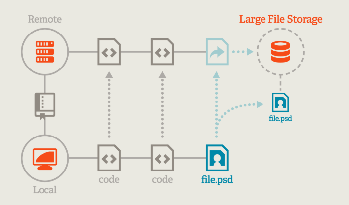

# Large File Storage

Git Large File Storage (LFS) replaces large files such as audio samples, videos, datasets, and graphics 
<br>with text pointers inside Git, while storing the file contents on a remote server like GitHub.com or GitHub Enterprise.
<br><br><br><br>

1. Download and install the Git command line extension. 
2. download [Git LFS](https://git-lfs.github.com/)
3. Place the file in a directory that is included in the path. 
    <br>I placed it on my Git directory C:\Program Files\Git\cmd\

4. set up Git LFS for your user account by running: 
  <br>`git lfs install`
  <br>You only need to run this once per user account.

5. In each Git repository where you want to use Git LFS, select the file types you'd like Git LFS to manage
  <br> example `git lfs track "*.xlsx"`
  <br> This command creates .getattributes file with the content below
  <br> ***.xlsx filter=lfs diff=lfs merge=lfs -text**
  <br> alternatively you directly edit your .gitattributes. You can configure additional file extensions at anytime.

6. Now make sure .gitattributes is tracked:
  <br>git add .gitattributes
7. Add the large file, commit and push to GitHub as you normally would.
  <br>git add file.psd
  <br>git commit -m "Add design file"
  <br>git remote add origin "https://github.com/faramarzamirshahi/test.git"
  <br>git push origin master
 ```
 D:\Users\Faramarz\UofT\ClassProjects\test>git init
Initialized empty Git repository in D:/Users/Faramarz/UofT/ClassProjects/test/.git/

D:\Users\Faramarz\UofT\ClassProjects\test>dir
 Volume in drive D is DATA
 Volume Serial Number is 6E5D-8195

 Directory of D:\Users\Faramarz\UofT\ClassProjects\test

2020-08-24  09:27 PM    <DIR>          .
2020-08-24  09:27 PM    <DIR>          ..
2020-08-24  04:37 PM       109,766,034 data-1-1-3-StarterBook.xlsx
               1 File(s)    109,766,034 bytes
               2 Dir(s)  784,167,309,312 bytes free

D:\Users\Faramarz\UofT\ClassProjects\test>git lfs track "*.xlsx"
Tracking "*.xlsx"

D:\Users\Faramarz\UofT\ClassProjects\test>dir
 Volume in drive D is DATA
 Volume Serial Number is 6E5D-8195

 Directory of D:\Users\Faramarz\UofT\ClassProjects\test

2020-08-24  09:28 PM    <DIR>          .
2020-08-24  09:28 PM    <DIR>          ..
2020-08-24  09:28 PM                44 .gitattributes
2020-08-24  04:37 PM       109,766,034 data-1-1-3-StarterBook.xlsx
               2 File(s)    109,766,078 bytes
               2 Dir(s)  784,167,309,312 bytes free

D:\Users\Faramarz\UofT\ClassProjects\test>git add .gitattributes

D:\Users\Faramarz\UofT\ClassProjects\test>git add data-1-1-3-StarterBook.xlsx

D:\Users\Faramarz\UofT\ClassProjects\test>git commit -m "Add analysis file"
[master (root-commit) 319a53b] Add analysis file
 2 files changed, 4 insertions(+)
 create mode 100644 .gitattributes
 create mode 100644 data-1-1-3-StarterBook.xlsx

D:\Users\Faramarz\UofT\ClassProjects\test>git remote add origin "https://github.com/faramarzamirshahi/test.git"

D:\Users\Faramarz\UofT\ClassProjects\test>git push -u origin master
Uploading LFS objects: 100% (1/1), 110 MB | 1.8 MB/s, done.
Enumerating objects: 4, done.
Counting objects: 100% (4/4), done.
Delta compression using up to 8 threads
Compressing objects: 100% (3/3), done.
Writing objects: 100% (4/4), 429 bytes | 429.00 KiB/s, done.
Total 4 (delta 0), reused 0 (delta 0), pack-reused 0
To https://github.com/faramarzamirshahi/test.git
 * [new branch]      master -> master
Branch 'master' set up to track remote branch 'master' from 'origin'.

D:\Users\Faramarz\UofT\ClassProjects\test>git status
On branch master
Your branch is up to date with 'origin/master'.

nothing to commit, working tree clean
```
